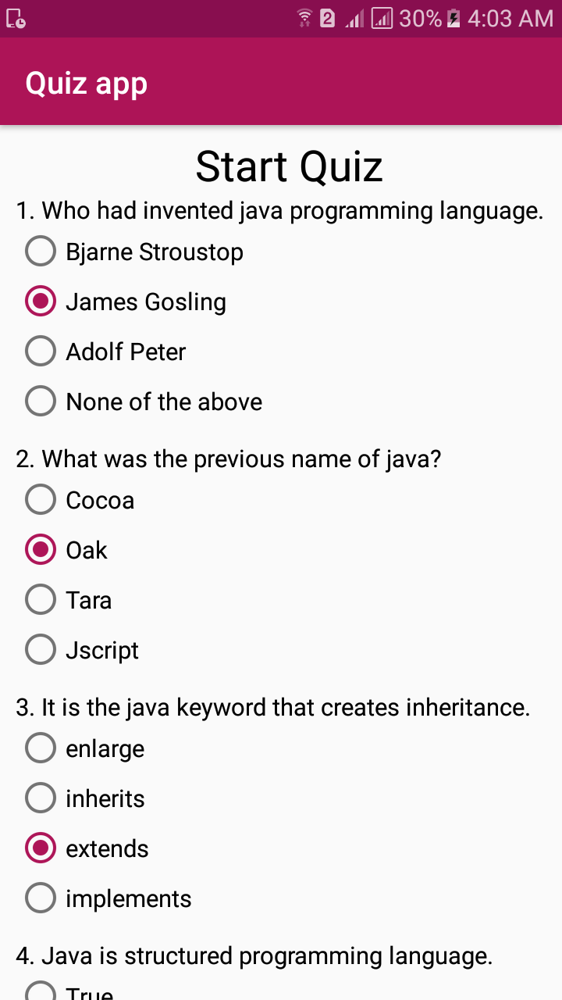
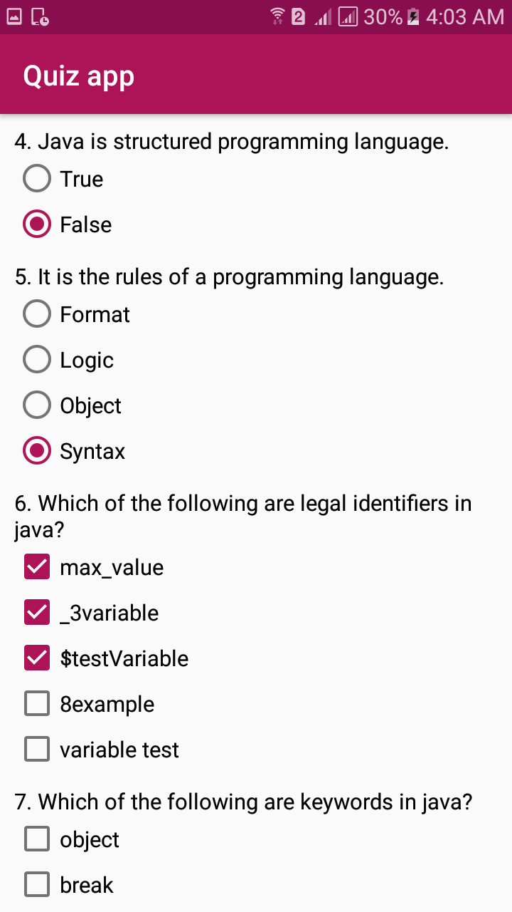
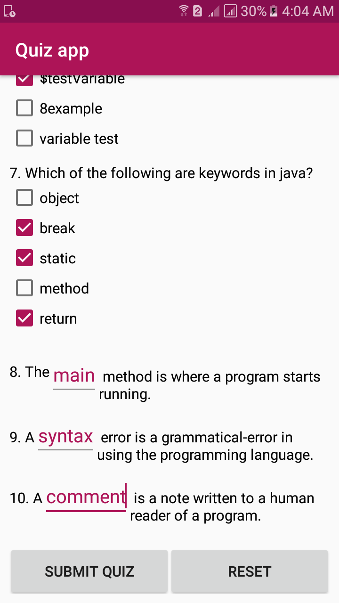
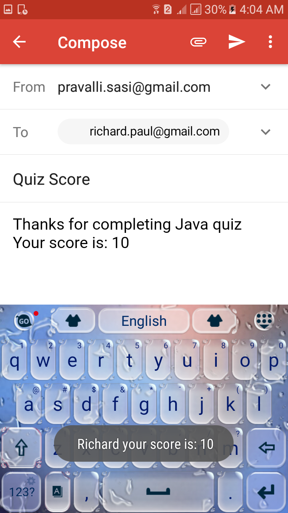

# QuizApp

## Overview
This is a simple android Quiz app where the user can enter his/her name and email id in the given blanks to start the quiz. There will be a few questions in java that includes Radio buttons, checkboxes, Buttons and so on. When the submit button is clicked the total score will be displayed in the form of a toast message. And when the reset button is clicked all the fields will be set to blank.

## Quiz App Screenshots

<table>
  <tr>
    <td></td>
    <td></td>
  </tr>
<table>
  
  
  <table>
  <tr>
    <td></td>
    <td></td>
  </tr>
<table>
  
  <table>
  <tr>
    <td></td>
  </tr>
<table>
